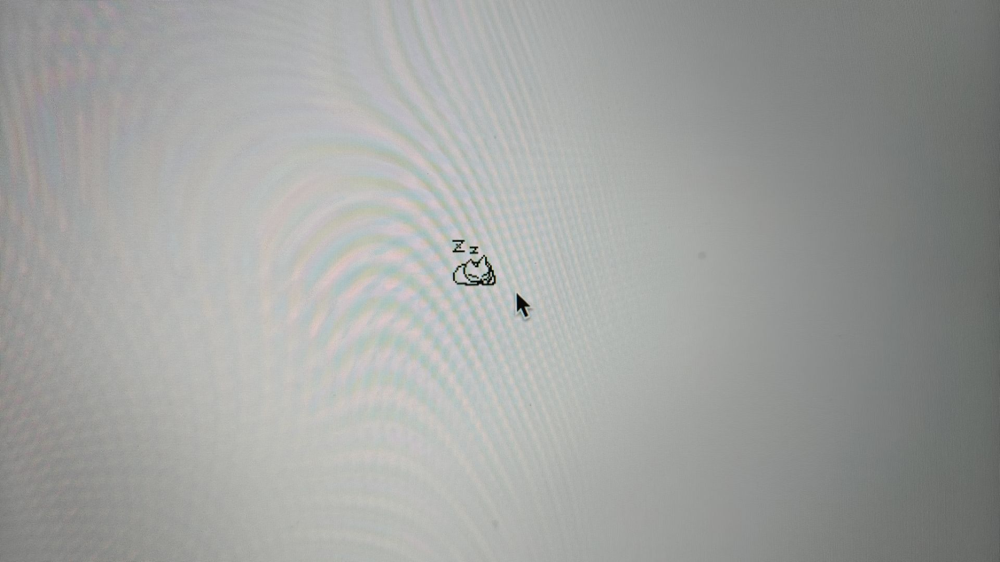

# nuxt-oneko



A nuxt plugin to add a kitten to your website.

It comes from the [oneko.js](https://github.com/adryd325/oneko.js), before import more troublesome, so I put it into a module, now you only need to via NPM install and then into the can, without any extra operation.

```bash
npm i nuxt-oneko
```

```typescript
export default defineNuxtConfig({
	modules: ["nuxt-oneko"],
});
```
